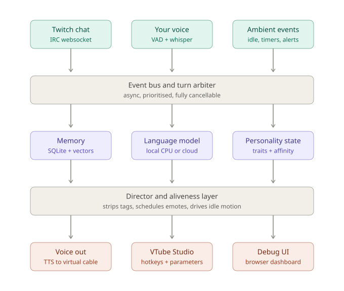

# Chao Companion — Design Document

**Version:** 0.2
**Status:** Ready for implementation
**Target hardware:** Ryzen 9 5900X (12C/24T), EVGA RTX 3070 8GB, 32GB DDR4, Windows

### Changelog since v0.1

- **Zero-VRAM architecture.** Gameplay streaming is confirmed, so STT moves to CPU and the GPU is left entirely to the game (§2)
- **Real emote inventory mapped.** The chao's assets split into an eyes channel and a ball channel; the design now uses both explicitly (§6)
- **Fly is a state machine**, not an emote (§6.4)
- **Heart is gated on affinity**, making long-term growth visible on screen (§6.3)
- **Webcam vs. programmatic control resolved** (§7)
- **Growth surfaces made explicit** — what may drift and what may not (§5.3)
- **Dashboard promoted** from debug tool to primary development interface, with a full spec (§11)
- **Repo layout and event schema added** for implementation handoff (§13, §14)

---

## 1. Overview

An LLM-driven companion character rendered through VTube Studio. The chao listens to the streamer's voice and to Twitch chat, responds with synthesized speech, and expresses itself physically through VTS emotes and continuous motion parameters. It accumulates memory across sessions, and its personality is shaped by what happens to it over time.

### 1.1 Core design principle

**VTube Studio is the renderer in both modes.** There is no separate local renderer to build. VTS runs as a desktop window; OBS captures it when live, and during testing you watch the VTS window directly. The only things that change between local testing and streaming are which inputs are enabled and where audio is routed.

What we are building is a headless brain that speaks two protocols: **audio out** and **VTube Studio websocket in**.

### 1.2 Goals

- Responds to streamer voice and Twitch chat with under ~1.5s perceived latency
- Feels physically alive at all times, not only when speaking
- Runs alongside a game with zero GPU contention
- Retains memory across sessions and recognises returning viewers
- Personality grows measurably over weeks while remaining recognisably the same character

### 1.3 Non-goals (v1)

- Custom Live2D rendering
- Lip sync and viseme mapping — **the chao has no mouth**
- Webcam-driven puppeteering (see §7.3)
- Multi-character interaction
- Voice cloning

---

## 2. Hardware envelope

Gameplay runs simultaneously on the same machine. The GPU is therefore treated as unavailable, and every component is placed on CPU or in the cloud.

| Component | Placement | VRAM | Notes |
|---|---|---|---|
| Speech-to-text | CPU | 0 GB | faster-whisper `base`, int8, 4–6 threads |
| Text-to-speech | CPU | 0 GB | Piper |
| Embeddings | CPU | 0 GB | bge-small / MiniLM, batch only |
| Language model | Cloud | 0 GB | CPU fallback for dev and reflection |
| **Total** | | **0 GB** | |

A 0.6GB whisper model on the GPU looks harmless until a title at 1440p is already sitting near 7.5GB. Crossing the limit doesn't cost a little performance — it causes texture thrashing and stutter, live on stream. Not a trade worth making for a component that runs acceptably on CPU.

**CPU budget.** A game meaningfully uses 4–6 cores of the 12 available. Whisper is bursty (~300ms on 4–6 threads for a 3-second utterance), Piper is nearly free, and the cloud LLM consumes none. Pin the audio pipeline to specific cores if scheduling contention shows up in the latency waterfall.

**GPU budget.** Zero. This is the point.

---

## 3. System architecture



Data flows top to bottom. Every stage below the event bus must be cancellable — interrupting the chao mid-sentence is a first-class requirement, not a nice-to-have.

---

## 4. Component specification

### 4.1 Input layer

**Twitch chat.** Websocket to Twitch IRC (`wss://irc-ws.chat.twitch.tv:443`) via `twitchio`. Chat is not forwarded wholesale to the brain; a selection policy scores each message and most are dropped.

| Priority | Trigger | Action |
|---|---|---|
| 1 | Direct mention of the chao's name | Full spoken response |
| 2 | Question directed at chat or streamer | Response if cooldown allows |
| 3 | High-affinity viewer speaking | Response or emote-only reaction |
| 4 | Chat velocity spike | Emote-only reaction, no speech |
| 5 | Everything else | Logged to memory, no response |

Global speech cooldown ~15s so the chao doesn't monologue over the stream.

**Voice.** Continuous mic capture → Silero VAD endpointing → faster-whisper transcription. VAD silence threshold ~500ms; this is the single biggest perceptual latency lever, so expose it in config and tune by feel.

**Ambient events.** Timers, idle detection, follower and sub alerts, OBS scene changes. Mostly produce non-verbal reactions (§10.4).

### 4.2 Event bus and turn arbiter

Single async loop with a priority queue.

- Deduplicates and ranks incoming events
- Enforces cooldowns and turn-taking; the chao must never talk over itself or over you
- Holds a cancellation token for the in-flight response
- Emits `brain.request` the instant a turn starts, so the aliveness layer can react before any audio exists (§10.5)

### 4.3 Brain

Stateless per call. Assembles a prompt from four sources and streams tokens back out. Backend is pluggable (§5).

Prompt structure, in order:

1. **Core identity** (immutable) — fixed temperament, speech style, hard constraints
2. **Personality state** (mutable) — current traits, mood baseline, learned opinions
3. **Retrieved memory** — relevant episodes and viewer facts
4. **Recent context** — last N turns verbatim
5. **Current event** — explicitly delimited, labelled untrusted if it came from chat

Blocks 1 and 2 change rarely and sit at the top so they can be prompt-cached. This matters for both latency and cost.

### 4.4 Memory

Four layers in one SQLite file, so everything stays inspectable and hand-editable.

```sql
CREATE TABLE viewers (
  id              INTEGER PRIMARY KEY,
  twitch_login    TEXT UNIQUE NOT NULL,
  display_name    TEXT,
  first_seen      TEXT NOT NULL,
  last_seen       TEXT NOT NULL,
  interactions    INTEGER DEFAULT 0,
  affinity        REAL DEFAULT 0.0,   -- -1.0 .. 1.0, gates heart emote
  notes           TEXT                 -- freeform, written by reflection
);

CREATE TABLE episodes (
  id              INTEGER PRIMARY KEY,
  ts              TEXT NOT NULL,
  session_id      INTEGER NOT NULL REFERENCES sessions(id),
  source          TEXT NOT NULL,       -- 'voice' | 'chat' | 'ambient'
  viewer_id       INTEGER REFERENCES viewers(id),
  content         TEXT NOT NULL,
  chao_response   TEXT,
  valence         REAL,                -- -1.0 .. 1.0, how it felt
  importance      REAL NOT NULL        -- 0.0 .. 1.0, scored at write time
);

CREATE TABLE beliefs (
  id              INTEGER PRIMARY KEY,
  created         TEXT NOT NULL,
  last_reinforced TEXT NOT NULL,
  strength        REAL NOT NULL,       -- decays without reinforcement
  subject         TEXT,                -- viewer login, topic, or NULL for self
  statement       TEXT NOT NULL        -- "dislikes being called a bean"
);

CREATE TABLE sessions (
  id              INTEGER PRIMARY KEY,
  started         TEXT NOT NULL,
  ended           TEXT,
  mode            TEXT NOT NULL,       -- 'live' | 'local'
  summary         TEXT
);

CREATE VIRTUAL TABLE episode_vec USING vec0(
  episode_id INTEGER PRIMARY KEY,
  embedding  FLOAT[384]
);
```

**Retrieval per turn** combines three cheap queries: exact viewer lookup, top-k vector search over episodes weighted by `importance × recency`, and beliefs above a strength threshold for the current subject. Budget ~800 tokens total. Structured lookups do most of the useful work; vector search is garnish, not the meal.

### 4.5 Director

Sits between the token stream and the outputs.

- Parses and strips inline tags (§9) from the stream
- Buffers to sentence boundaries, hands clean text to TTS
- Schedules emote hotkeys against the **audio playback clock**, not token arrival
- Computes the audio envelope and drives motion parameters (§8)
- Maintains continuous mood state, decays it toward baseline
- Owns the aliveness layer (§10)

The director is deterministic. The LLM never emits parameter values — it emits sparse semantic tags, and the director decides what those mean physically. This keeps behaviour consistent and lets you retune expressiveness without touching the model or the prompt.

### 4.6 Output layer

**Audio.** TTS → VB-Audio Virtual Cable → captured by OBS. Mic and virtual cable are separate devices, so the chao's voice never re-enters STT and no echo cancellation is needed unless you monitor on speakers. STT is gated off during playback regardless.

**VTube Studio.** Plugin websocket on `ws://localhost:8001`. One-time token auth, token cached to disk. Two output channels (§6).

**Dashboard.** See §11 — this is the primary development interface, not an afterthought.

---

## 5. Language model

Both backends behind one interface. Switching is config, not code.

```python
class LLMBackend(Protocol):
    async def stream(
        self,
        system: str,
        messages: list[Message],
        cancel: asyncio.Event,
    ) -> AsyncIterator[str]: ...
```

### 5.1 Cloud (default for live)

Small/fast tier model from any major provider, streaming enabled.

| Property | Value |
|---|---|
| VRAM / RAM | 0 |
| Time to first token | ~0.3–0.6s |
| Cost | ~$1–5/month at projected volume |

**Cost model.** ~2500 input and ~120 output tokens per response, 40 responses/hour, 36 hours/month:

```
1,440 responses/month → ~3.6M input tokens, ~0.17M output tokens
```

At typical small-tier rates this lands in the low single digits of dollars per month. **Prompt caching cuts it substantially** — identity plus personality is ~1200 stable tokens of that 2500 and caches across every call in a session, usually at a steep discount. Verify current pricing when picking a provider; rates move.

**Tradeoffs:** best instruction-following (the tag protocol will just work), best latency, leaves the entire machine free. Requires network mid-stream, and the mic transcript leaves the building.

### 5.2 Local CPU (dev and reflection)

**Update (phase 1 implementation):** built against **Ollama**, not a raw `llama.cpp` server as originally planned — `OllamaBackend` (`src/chao/brain/local.py`) speaks Ollama's `/api/chat` streaming endpoint at `http://localhost:11434`. Same underlying idea (CPU-only, quantized 8B-class GGUF inference, zero VRAM via `OLLAMA_NUM_GPU=0`), different delivery mechanism — Ollama's own model management (`ollama pull`, `OLLAMA_MODELS` to relocate storage off the system drive) replaced hand-rolling a `llama.cpp` server process. Confirmed working: `qwen3:8b`.

| Property | Value |
|---|---|
| VRAM | 0 GB (`OLLAMA_NUM_GPU=0`) |
| Model | `qwen3:8b`, CPU-only |
| Cold load | Real but not free — see `SESSION_STATE.md` for current measured figures; varies by run, don't treat any single number here as current |

The generation rate looks alarming and mostly isn't, because of sentence streaming (§12) — only time-to-first-token is perceptible. The real risk on CPU is **prefill**: reprocessing a 3000-token prompt every turn costs seconds. Mitigations:

- Keep identity and personality blocks byte-stable so the KV/slot cache can reuse them
- Cap retrieved memory to a fixed token budget
- Trim conversation history from the middle, never the top

### 5.3 Recommended split

Split by latency sensitivity rather than choosing one:

| Workload | Backend | Why |
|---|---|---|
| Live responses while streaming | **Cloud** | Best latency and tag reliability, zero local load |
| Local development and testing | **CPU** | Free iteration, no API spend on debugging |
| Reflection and summarization | **CPU (batch)** | Latency-irrelevant, runs overnight, free |

Reflection running locally even when live turns are cloud-hosted is a genuinely nice property: the high-volume, latency-insensitive work costs nothing.

Add a **circuit breaker** — if a cloud call fails or exceeds ~2s, fall back to local for that turn. A stuttering chao beats a frozen one.

---

## 6. Expression system

The chao's assets split into two independently addressable channels. This is a stronger affordance than a generic emote list and the design leans on it directly.

- **Eyes** carry sustained mood — slow, blended, decays to baseline
- **Ball** carries beat-level cognition — fast, transient, punctuation

The ball is effectively a thought bubble. That is why the latency-cover problem solves itself in-character (§10.5).

### 6.1 Current inventory

| Asset | Channel | Visual |
|---|---|---|
| happy | eyes + ball | eyes crease, heart above head |
| heart | ball | heart above head |
| angry | eyes | eyes slant |
| sad | eyes | sad eyes |
| surprise | ball | exclamation point above head |
| question | ball | question mark above head |
| confused | eyes + ball | `>.<` eyes, corkscrew above head |
| fly | state | toggle on/off |

### 6.2 Tag → expression mapping

| Tag | Eyes | Ball | Motion | Valence / Arousal |
|---|---|---|---|---|
| `[happy]` | creased | heart | bob up, fly-eligible | +0.7 / +0.6 |
| `[affection]` | creased | heart | slow bob toward target | +0.9 / +0.3 |
| `[curious]` | neutral | question | head tilt, look at source | +0.1 / +0.4 |
| `[surprise]` | wide | exclamation | sharp pop, ball overshoots | 0.0 / +0.9 |
| `[confused]` | `>.<` | corkscrew | slow wobble | -0.2 / +0.4 |
| `[sad]` | sad | — | droop, land if flying | -0.7 / -0.4 |
| `[angry]` | slanted | — | rigid, reduced bob | -0.6 / +0.8 |
| `[thinking]` | neutral | question | tilt, look away | transient only |

Selection rule: never fire the same hotkey twice consecutively where a pool exists. Weighted random, per-emote cooldowns. Repetition is the fastest way to break the illusion.

### 6.3 Heart is gated on affinity

Heart is not a mood expression — it is a **relationship** expression, and it is the mechanism that makes long-term growth visible on screen.

```
show_heart = (valence > 0.5) AND (target.affinity > HEART_THRESHOLD)
```

A first-time chatter gets creased eyes. A regular of six months gets a heart. Nobody has to read a memory dump to see that the chao has grown attached to specific people — it's rendered.

`HEART_THRESHOLD` starts around 0.4 and should be tuned so that it takes several sessions of positive interaction to cross. If everyone earns hearts in week one, the signal is worthless.

### 6.4 Fly is a state machine

Fly is the strongest signal in the inventory: binary, readable from across the room, and continuously visible. Treat it as an arousal indicator with **hysteresis** so it doesn't flutter at the boundary.

```
if not flying and arousal > 0.70: fly_on()
if     flying and arousal < 0.40: fly_off()
```

Additional hard rules: land on `[sad]` regardless of arousal, land during the sleepy/low-energy macro state (§10.6), and enforce a minimum 5s dwell in either state.

### 6.5 Recommended additions

You noted more can be mapped. In priority order:

1. **Neutral / reset** — mandatory. Every channel needs a known return state.
2. **Ellipsis `...` above head** — unimpressed, bored, waiting, dead air. Highest-value single addition for the aliveness layer.
3. **Sweat drop** — nervous, embarrassed, awkward. Covers a register currently unreachable.
4. **Sleepy eyes** — late-session energy decay.
5. **Music note** — reacting to music or hype without speaking.
6. **Double exclamation** — separates excitement from alarm; `surprise` currently has to do both jobs.

### 6.6 Channel conflict

VTS expressions triggered by hotkey can override parameter-driven deformation on the same model regions. Rule: **hotkeys are transient punctuation, parameters carry sustained state.** Keep authored emotes short with fade-out, never sustain one beyond ~4s. Conflicts get resolved in the VTS expression config, not in code.

---

## 7. Driving a webcam-tracked model programmatically

### 7.1 Why this works

The webcam does not drive the Live2D model directly. It populates **input parameters** (`FaceAngleX`, `EyeOpenLeft`, `MouthSmile`…), which VTS then maps onto **Live2D model parameters** through its settings UI.

A plugin-injected parameter is treated **identically to webcam input**. Create `ChaoBodyBob` via `ParameterCreationRequest`, then bind it to a Live2D parameter in VTS exactly the way you'd bind `FaceAngleY`. Same UI, same workflow, no special path.

### 7.2 `set` vs `add`

`InjectParameterDataRequest` supports two modes:

- **`set`** — overwrite the parameter value outright
- **`add`** — layer the value on top of whatever tracking already provides

`add` allows programmatic motion over a webcam base pose. Useful to know; not what this project uses.

### 7.3 Recommendation: fully programmatic, tracking off

Turn face tracking off. You'll be looking at the game, not the camera. A chao that mirrors your head while you stare down a boss fight isn't a companion — it's a mirror. Autonomy is the entire point of the project.

### 7.4 Phase 0 diagnostic

Send `Live2DParameterListRequest` and dump the full response. This returns every Live2D parameter the model actually exposes. You're checking for the standard Cubism set:

- `ParamAngleX` / `ParamAngleY` / `ParamAngleZ` — head rotation
- `ParamBodyAngleX` / `ParamBodyAngleY` / `ParamBodyAngleZ` — body lean
- Whatever the rigger named the ball's position parameters

**If the ball has no independent position parameter, the spring in §8.2 cannot run and this becomes a rigging task rather than a code task.** That is the highest-consequence unknown in the project, which is why it's phase 0. Find out on day one.

---

## 8. Motion without a mouth

No visemes, no phoneme alignment, no Rhubarb. This removes the fiddliest part of the usual VTuber pipeline.

The chao still needs a **speaking tell** — something that says the sound is coming from this creature. Chao communicate through body language and the ball, so that's where the speech signal goes.

### 8.1 Envelope extraction

TTS synthesizes a full sentence before playback, so the entire waveform is available. Compute RMS at 60Hz, normalise, apply short attack and longer release smoothing, replay against the audio clock.

```
audio buffer → RMS @ 60Hz → normalise → smooth → ChaoSpeechEnergy
```

Routed to:

- **Body bob** — vertical translation, amplitude scaled by arousal
- **Head nod** — small pitch impulses on envelope peaks (syllable stress proxy)
- **Ball bounce** — via the spring below

### 8.2 Ball spring (highest-value single feature)

**Update:** the rigger added a dedicated physics group for the ball (`xp4`/`yp5`) with the lag below baked in natively — confirmed live in VTS. The pseudocode is kept here as the *behavioral spec* the rig now satisfies, not code we still need to write:

```
ball_target = head_position
accel  = (ball_target - ball_pos) * stiffness - ball_vel * damping
ball_vel += accel * dt
ball_pos += ball_vel * dt
```

(Originally: `stiffness ≈ 120`, `damping ≈ 14`, at 60Hz, tuned to overshoot slightly and settle in roughly a third of a second — now the rigger's call, baked into the model's `.physics3.json`.)

This sells "physical creature with mass" more convincingly than any amount of expression authoring, and it's still always on, during speech and idle and emotes alike, at zero code-side cost. It also pairs with the ball's shape changes: a heart that *swings* into place reads far better than one that appears.

**Verified:** with face tracking off, moving the model in VTS makes the ball visibly lag — the physics group reacts on its own to model movement, no plugin-side binding required. `docs/rigging_check_list.md` item 1 is resolved.

### 8.3 Emotion modulation

The same envelope maps differently by mood. High arousal → larger bob amplitude. Low valence → smaller amplitude, downward posture offset. One signal, many readings.

**Update:** "faster/slower spring response" by mood is no longer achievable — since §8.2's spring moved into the rig's native physics, its stiffness/damping are baked into the model file at rig time, not exposed by the VTS API for runtime modulation. Amplitude and posture offset (this section's other two levers) are unaffected, since those come from how far we drive the head/body, which the physics group then lags behind.

---

## 9. Tag protocol

The LLM emits sparse inline tags; the director strips them before TTS.

```
[happy] Oh! You're back! [sad] You said five minutes.
```

Rules:

- Tags appear at the start of a sentence
- At most one per sentence
- Unknown tags are silently dropped
- The parser must be tolerant — malformed tags must never crash a turn or leak into TTS text

Supported: `[happy]` `[affection]` `[curious]` `[surprise]` `[confused]` `[sad]` `[angry]` `[thinking]`, plus `[look:chat]` / `[look:you]` and `[pause]`.

Keep the vocabulary small, especially when running the local backend.

---

## 10. Aliveness layer

The system that makes the chao feel alive, running **independently of the LLM**. Most of what reads as alive costs zero tokens and zero latency.

### 10.1 Three timescales

| Timescale | Rate | Behaviours |
|---|---|---|
| **Micro** | 60 Hz | Breathing, idle drift, ball spring, blink timing |
| **Meso** | ~1 Hz | Weight shifts, attention changes, small reactive emotes |
| **Macro** | ~1/min | Mood baseline drift, boredom, energy decay, fly state |

### 10.2 Noise, not sine waves

Idle drift must be non-periodic — humans detect a loop within about thirty seconds. Use smoothed value noise or an Ornstein–Uhlenbeck process per parameter. Blinks in particular should cluster and vary; a metronome blink is uncanny.

### 10.3 Attention model

The chao holds a focus target: `streamer`, `chat`, `idle`, or `self`. Focus drives look direction and biases emote selection.

- Streamer speaks → focus streamer
- Chat velocity spike → focus chat
- Nothing for ~20s → drift to idle, occasional glance back
- Named in chat → snap to chat, `[curious]`

A character visibly looking at something reads as attentive. A centred, still character reads as switched off, even while breathing.

### 10.4 Reactive silence

The highest-leverage behaviour in the system: **react physically far more often than you speak.** A chat message that doesn't earn a spoken response can still earn a head tilt or a question mark. This produces a chao that appears to follow along continuously at zero token cost and zero latency, while speech stays rare enough to stay interesting.

Target ratio: roughly **10 non-verbal reactions per spoken response.**

### 10.5 Anticipation

When a brain request fires, the director immediately pops the **question mark** on the ball and tilts the head, before any audio exists. The asset already exists and already means exactly this.

This covers the entire 0.5–1.5s latency window with in-character behaviour instead of dead air, and converts the project's biggest technical weakness into a character trait. Build it in phase 1.

### 10.6 Boredom and macro state

Slow accumulators that make behaviour depend on recent history:

- Attention starvation after long silence → droop, glances at streamer, `...` if mapped
- Sustained high engagement → elevated arousal baseline, more time flying
- Late in a long session → energy decay, slower idle motion, lands, sleepy eyes

These make two hours of stream feel like one continuous experience rather than a series of independent responses.

---

## 11. Dashboard

Not a debug tool bolted on afterward — the **primary development interface**. Personality cannot be iterated on by watching a VTuber model and guessing.

### 11.1 Architectural principle

**One structured event stream, three consumers.** The brain emits structured events; the dashboard renders them live, SQLite persists them as memory, and the reflection job reads them later. Do not write print statements and then build a dashboard on top — emit structured events from the first line of code, and the dashboard becomes a renderer over a log you needed regardless.

The dashboard is a **pure subscriber**. All authoritative state lives in the brain process; commands travel back over the same websocket as explicit messages. The dashboard crashing must never affect the chao mid-stream.

### 11.2 Panels

In rough order of how much they'll get used:

1. **Prompt inspector** — the exact assembled prompt for the last turn, collapsible by section (identity / personality / memory / history / event), with per-section token counts. Answers ~90% of "why did it say that."
2. **Retrieval trace** — what was retrieved with scores, **and what nearly made the cut**. Near-misses diagnose broken retrieval far faster than hits do.
3. **Event feed** — every event with priority and disposition: responded, emote-only, or dropped-with-reason. This is how the selection policy gets tuned.
4. **Mood plot** — live valence/arousal dot on a 2D plane with a decay trail, plus current baseline. Watching the dot move is how the emotion system gets tuned.
5. **Parameter sparklines** — live injected values, with the ball spring visualized. Instantly reveals bad damping.
6. **Latency waterfall** — stacked per-stage bars for recent turns. Shows which stage regressed the moment it does.
7. **Emote log** — which hotkey fired, why, and per-pool cooldown state.
8. **Override panel** — fire any emote, force a mood, inject a fake chat message, force a response, and the kill switch.
9. **Session counters** — tokens, cost, response count, uptime.

### 11.3 Two features worth the extra effort

**Session replay.** Every event to JSONL; the dashboard can scrub a past session. You will constantly need to know what happened in the ten seconds *before* something strange, and you cannot investigate that live while streaming.

**Prompt re-run.** Click any past turn, view its exact prompt, hit "re-run with current config," diff the output. This is how personality changes get iterated offline — deterministic, fast, no stream required.

### 11.4 Stack

FastAPI with a websocket for the event stream, Vite + React frontend, uPlot for streaming sparklines. Runs on a second monitor during stream and doubles as the live control panel.

**Presentation layer (added phase 1, session 6):** the frontend renders in a native OS window via `pywebview` (Windows: WebView2, the same Chromium-based runtime Edge uses, already present on the machine) rather than a Chrome tab. Same HTML/CSS/JS either way — pywebview is just a thinner shell than a full browser process, without the baseline overhead of an entire separate Chrome instance's tabs/extensions/renderer processes sitting alongside it. This matters here specifically because CLAUDE.md invariant 1 (zero VRAM, the user games on this machine) makes every megabyte of background overhead worth avoiding, even RAM outside the invariant's literal VRAM scope. `chao.dashboard.server`'s FastAPI app serves the built frontend (`web/dist/`, via `npm run build`) directly over HTTP alongside its websocket, so a single `uv run python -m chao` is self-contained; `chao.dashboard.window` is a separate small entry point that opens the native window pointed at it. Kept as two processes, not merged into one: pywebview's GUI loop must own the OS main thread, which conflicts with `__main__.py`'s asyncio loop already owning it in the brain process. Frontend development still uses `npm run dev` (Vite's dev server, port 5173, hot reload) — the native window is the production/streaming presentation, not the dev workflow.

---

## 12. Latency budget

Target: under 1.5s from end of speech to start of audio.

| Stage | Budget | Notes |
|---|---|---|
| VAD endpoint | 300 ms | Biggest perceptual lever, expose in config |
| STT (CPU) | 300 ms | faster-whisper base int8 |
| Memory retrieval | 50 ms | Parallel with STT tail |
| LLM time-to-first-token | 400 ms | Cloud; 400–800ms local |
| Sentence buffer | 100 ms | First boundary |
| TTS first chunk | 200 ms | Piper |
| **Total** | **~1.35 s** | |

**Sentence streaming is what makes this work.** Never wait for the full response. Buffer to the first sentence boundary, synthesize, begin playback, and continue generating during playback. Only time-to-first-token is perceptible.

Combined with the anticipation nudge (§10.5), *perceived* latency is near zero — the chao starts reacting within ~100ms and starts talking around 1.3s.

---

## 13. Event schema

The spine of the system. Every component emits these; the bus, dashboard, memory writer and session log all consume them.

```python
@dataclass(frozen=True)
class Event:
    id: str  # uuid
    ts: float  # monotonic, for latency math
    turn_id: str | None
    kind: str
    payload: dict
```

| Kind | Emitted by | Key payload |
|---|---|---|
| `input.chat` | twitch | login, display_name, text |
| `input.voice` | voice | text, confidence, duration_ms |
| `input.ambient` | ambient | source, detail |
| `decision.selected` | arbiter | priority, reason |
| `decision.dropped` | arbiter | reason, cooldown_remaining |
| `brain.request` | brain | prompt_sections, token_counts, backend |
| `brain.token` | brain | text (streamed) |
| `brain.complete` | brain | full_text, latency_ms, usage |
| `director.tag` | director | tag, sentence_index |
| `director.emote` | director | pool, hotkey_id, reason |
| `director.mood` | director | valence, arousal, baseline_valence, baseline_arousal |
| `output.speech_start` / `end` | tts | sentence, duration_ms |
| `vts.param` | vts | name, value (sampled, not every frame) |
| `state.fly` | aliveness | flying, trigger |
| `error` | any | component, message, traceback |

`turn_id` threads a full interaction together, which is what makes the latency waterfall and prompt re-run possible.

---

## 14. Repository layout

```
chao/
├── pyproject.toml
├── config/
│   ├── chao.yaml            # runtime config, backend selection, thresholds
│   ├── emotes.yaml          # hotkey pools, cooldowns, reactions
│   └── identity.md          # immutable core trait sheet
├── src/chao/
│   ├── __main__.py
│   ├── events.py            # Event dataclass, kinds
│   ├── bus.py               # priority queue, turn arbiter, cancellation
│   ├── inputs/
│   │   ├── twitch.py
│   │   ├── voice.py         # VAD + STT
│   │   └── ambient.py
│   ├── brain/
│   │   ├── backend.py       # LLMBackend protocol, circuit breaker
│   │   ├── cloud.py
│   │   ├── local.py
│   │   └── prompt.py        # assembly, token budgeting
│   ├── memory/
│   │   ├── store.py         # SQLite schema + writes
│   │   ├── retrieval.py
│   │   └── reflection.py    # offline job
│   ├── director/
│   │   ├── director.py
│   │   ├── tags.py          # tolerant parser
│   │   ├── mood.py          # valence/arousal state
│   │   ├── motion.py        # envelope, ball spring
│   │   └── aliveness.py     # three timescales, attention, fly
│   ├── outputs/
│   │   ├── tts.py
│   │   ├── audio.py
│   │   └── vts.py           # websocket client, auth, param injection
│   └── dashboard/
│       ├── server.py        # FastAPI + websocket
│       └── web/             # Vite + React
├── data/
│   ├── chao.db
│   └── sessions/            # JSONL replay logs
└── tests/
```

**Config example:**

```yaml
# emotes.yaml
pools:
  happy:      { hotkeys: [chao.happy], cooldown_s: 4, duration_s: 2.5 }
  heart:      { hotkeys: [chao.heart], cooldown_s: 12, duration_s: 3.0 }
  curious:    { hotkeys: [chao.question], cooldown_s: 3, duration_s: 2.0 }
  surprise:   { hotkeys: [chao.surprise], cooldown_s: 6, duration_s: 1.5 }
  confused:   { hotkeys: [chao.confused], cooldown_s: 8, duration_s: 3.0 }
  sad:        { hotkeys: [chao.sad], cooldown_s: 10, duration_s: 4.0 }
  angry:      { hotkeys: [chao.angry], cooldown_s: 15, duration_s: 3.0 }
  neutral:    { hotkeys: [chao.neutral], cooldown_s: 0, duration_s: 0 }

fly:
  hotkey: chao.fly
  on_above: 0.70
  off_below: 0.40
  min_dwell_s: 5

heart_gate:
  affinity_threshold: 0.4
  valence_threshold: 0.5

reactions:            # non-verbal only, no LLM call
  chat_spike:     surprise
  name_mention:   curious
  new_follower:   happy
  long_silence:   sad
  streamer_laugh: happy
  thinking:       curious
```

---

## 15. Safety and moderation

Twitch chat is adversarial input. Assume injection attempts within minutes of going live.

- **Never** interpolate chat text into the system prompt. Chat goes in the user turn, wrapped in explicit delimiters and labelled untrusted third-party content.
- Output-filter generated text before TTS. AutoMod covers what viewers say, not what your bot says.
- Sanitize usernames before speaking them; prefer display names, filter aggressively, fall back to "someone in chat."
- Bind a **physical mute/kill hotkey** that cancels the in-flight turn and silences output in under a second. Non-negotiable before the first live test.
- Rate-limit globally, independent of the selection policy, as a backstop.
- Log every prompt and response for post-stream review.

---

## 16. Personality growth

### 16.1 Two layers

**Core traits (immutable).** A hand-written trait sheet in `config/identity.md`. Never modified by the system. This is what stops six months of drift from producing an incoherent character.

**Mutable state.** Opinions, preferences, relationships, mood baseline. Written only by the reflection job.

### 16.2 Reflection

Runs offline between sessions, never during. Reads recent high-importance episodes and writes conclusions into `beliefs`. This is the Generative Agents pattern (Park et al., 2023), and it's what produces "shaped by experience" rather than "has a long log file."

Guardrails: cap `beliefs` at ~50 active rows, decay `strength` every pass for anything not reinforced, prune below threshold. Everything is plain text in SQLite and hand-editable when the chao develops an opinion you'd rather it didn't.

### 16.3 What may drift, and what may not

Growth must show up in **what the chao knows and who it likes**, never in **how it sounds**.

| May drift | Must not drift |
|---|---|
| Who receives hearts | Speech register |
| What it brings up unprompted | Vocabulary |
| Running jokes it holds | Humour style |
| Default emote pool weights | Core temperament |
| Resting mood baseline | Hard constraints |

A viewer noticing "it remembered my cat" or "it likes them more than it used to" reads as growth. A viewer noticing "it talks differently than last month" reads as broken.

### 16.4 Alignment scalar

A single slow-moving value in `[-1, 1]` derived from accumulated interaction valence, mirroring the source material's own alignment mechanic — a creature whose nature bends toward how it's treated. Effects stay small: baseline posture, default emote pool weights, resting arousal. Visible over months, invisible over hours.

---

## 17. Build phases

Sequenced by uncertainty, not dependency. Prove the unknowns first.

| Phase | Deliverable | Proves |
|---|---|---|
| **0** | Connect to VTS, authenticate, dump `Live2DParameterListRequest`, trigger a hotkey, inject a custom parameter | The only genuinely unknown integration — and whether the ball has position params |
| **1** | Typed text → LLM → tags → emote fires. **Dashboard live.** Anticipation nudge works. | End-to-end brain and director |
| **2** | TTS, audio routing, envelope-driven motion, ball spring, stream subtitle overlay, personality/voice test segment | The chao appears to speak |
| **3** | Aliveness: idle noise, attention, reactive silence, fly state machine | The chao appears alive |
| **4** | Twitch chat, selection policy, kill switch | First live test possible |
| **5** | Voice input with VAD | Full conversational loop |
| **6** | Memory layers and retrieval | Continuity across sessions |
| **7** | Reflection, affinity, heart gating, alignment | Shaped by experience |

Phase 3 before phase 4 is deliberate. A chao that idles beautifully and says nothing is a better stream presence than one that talks well and stares blankly between responses.

The dashboard lands in phase 1, not later. Every phase after it is faster because it exists.

Phase 2 also needs a stream-facing subtitle overlay — separate from the dashboard, which is a streamer-only debug tool, not something viewers see — and a personality/voice test segment: a way to iterate on the chao's character and TTS voice without a live audience. The test segment is likely an extension of `__main__.py`'s typed-input loop (already proven in phase 1) once TTS exists, rather than a separate tool.

---

## 18. Technology summary

| Concern | Choice |
|---|---|
| Language / runtime | Python 3.11+, asyncio throughout |
| IDE | PyCharm (unified, free core tier covers this project) or VS Code; WebStorm already covers the dashboard frontend |
| Twitch | `twitchio` |
| VAD | `silero-vad` |
| STT | `faster-whisper` base, int8, **CPU** |
| TTS | Piper (CPU) — confirmed at phase 2 kickoff; voice selection still open (§19) |
| LLM (cloud) | Small/fast tier, streaming, prompt caching on |
| LLM (local) | Ollama (`qwen3:8b`), CPU-only via `OLLAMA_NUM_GPU=0` — see §5.2 |
| Embeddings | `bge-small-en` or `all-MiniLM-L6-v2`, CPU |
| Storage | SQLite + `sqlite-vec` |
| VTS client | `pyvts`, or ~150 lines of raw websocket |
| Audio routing | VB-Audio Virtual Cable |
| Dashboard | FastAPI + Vite/React + uPlot, presented in a native `pywebview` window (§11.4) rather than a browser tab |
| Subtitle overlay | TBD, phase 2 — likely a lightweight browser-source page (transparent bg, OBS-captured) driven by `brain.token`/`output.speech_start`/`output.speech_end`, separate from the dashboard |

The TTS landscape moves quickly; re-evaluate at phase 2 rather than committing now.

---

## 19. Open questions

1. **Does the ball have independent position parameters?** Yes, as of the rigger's update: `xp4`/`yp5` (ball X/Y) plus `yp6` (bubble scale, unrelated to position), all in a new physics group. The lag is native to the rig's physics — no code-side spring needed for §8.2. Verified with face tracking off: moving the model in VTS makes the ball lag on its own, no plugin binding required. `docs/rigging_check_list.md` item 1 is resolved.
2. **Which emote additions from §6.5 get mapped, and when?** **Update:** `neutral` turned out not to block phase 1 in practice — nothing currently fires it (no tag maps to it), so it shipped without a matching VTS expression, shelved until it resurfaces (see `SESSION_STATE.md`). Ellipsis is still the highest-value optional, not yet built.
3. **Should the chao hear game audio?** Reacting to what you're playing is compelling but adds an audio-classification pipeline. Deferred past v1.
4. **What is the chao's voice?** Piper voice selection at phase 2; pitch shifting may be needed to match the character.
5. **How is affinity earned and lost?** The scoring function needs design before phase 7 — sentiment alone is probably too noisy.
6. **Where does the personality/voice test segment live?** Likely `__main__.py`'s existing typed-input loop, extended once TTS exists — not a separate tool. Needs deciding at phase 2 alongside the TTS model itself.
7. **What does the subtitle overlay actually look like?** Separate surface from the dashboard (viewer-facing, not streamer-only); design TBD at phase 2 — see §18.
